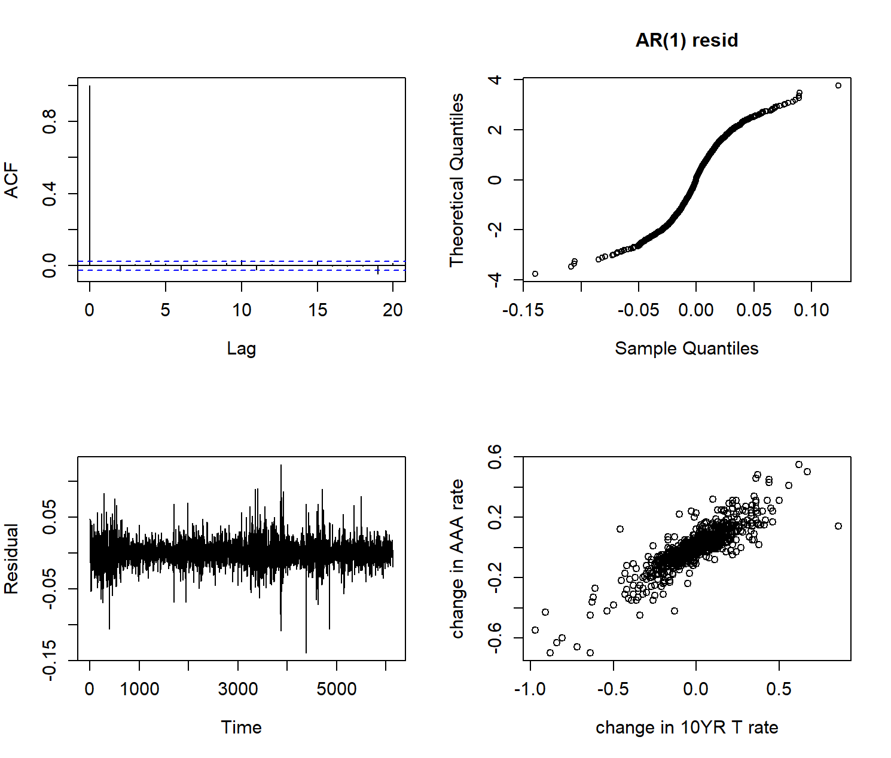

# Financial-Econometrics-with-R-photos
Photos of Financial-Econometrics-with-R

https://cloud.tencent.com/developer/article/1411506
👆上传图片的方法参考

我写文件的时候，默认把图片保存在typora的md文件所在的文件夹下。
但是分享出去的时候，没有办法把文件夹也同时zip下来分享给别人，所以别人看不到我的图片。所以需要把我的图片上传到互联网上，这样在md文件中引用的图片才能更方便地被看到。

这个是md文档里引用图片的格式

本来存在同一个文件夹下，我的引用方法为：
现在引用github图片仓库之后，我的引用方法为：
[]内的东西不重要，是相当于图片的名字的东西。

为了快速统一替换，我可以在typora中按住ctrl+h,将image-替换为https://raw.githubusercontent.com/Charlotte324/Financial-Econometrics-with-R-photos/main/image-

https://blog.51cto.com/itMonon/3396788
【Github】解决GitHub文件无法下载的问题

https://blog.csdn.net/Jasonkun_3/article/details/114435640
解决github.com 的响应时间过长

https://zh.wikihow.com/%E5%88%B7%E6%96%B0-DNS
刷新DNS
